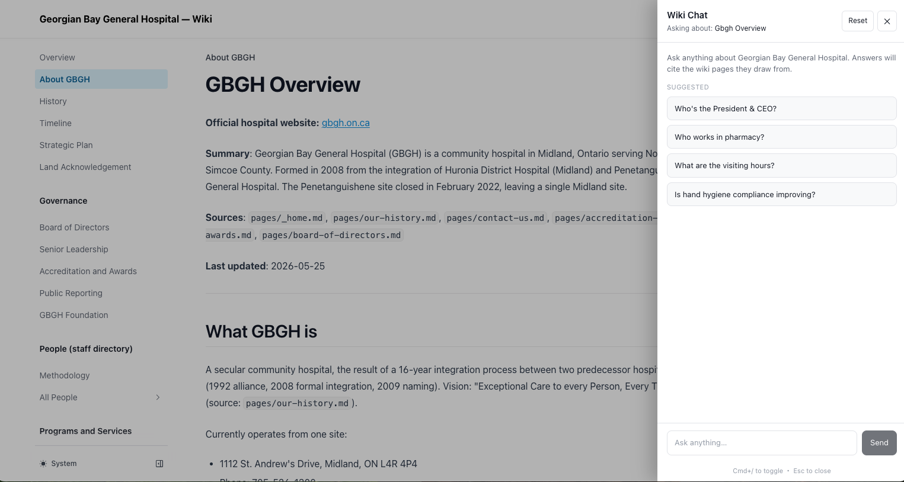

# GBGH Wiki Site

Unofficial reference wiki for Georgian Bay General Hospital (Midland, ON). Not affiliated with GBGH.

Built from a public scrape of `gbgh.on.ca` (services, governance, quality metrics).

## Stack

- [Next.js](https://nextjs.org/) 14
- [Nextra](https://nextra.site/) docs theme (full-text search, dark mode, mobile responsive)
- Tailwind CSS
- Floating chat panel powered by Groq (Llama 3.3 70B), with BM25 keyword retrieval over all 372 wiki pages

## AI Chat

A floating chat panel lives on every page. Click the bottom-right button (or press `Cmd+/`) to ask questions in plain language about the wiki. Answers cite the wiki pages they draw from with inline clickable links.



Per question, the API ranks all `.mdx` pages by BM25 against the user's query, sends the top 4 most relevant pages (plus the page they're viewing) to Groq's Llama 3.3 70B, and asks for an answer with markdown citations.

## Local dev

```bash
npm install
cp .env.local.example .env.local
# Add your Groq API key to .env.local
npm run dev
```

Open http://localhost:3000.

## Project layout

```
src/
  pages/                72 site pages (about, programs, governance, quality, news)
  pages/people/         Per-person notes + role-family hubs + index
  components/
    WikiChat.jsx        Floating chat panel (Cmd+/ to toggle)
  pages/api/
    chat.js             Groq proxy + BM25 retrieval
theme.config.jsx        Nextra theme config
```

## Chat

- Cmd+/ opens the chat panel from any page.
- Per query, the API ranks all wiki pages by BM25 against the question, sends the top 4 pages' content (plus the page the user is viewing) to Groq, and asks for an answer with inline markdown citations to the relevant pages.
- Free-tier Groq is sufficient for low traffic. Switch model via `GROQ_MODEL` in `.env.local`.

## License

MIT (template). Wiki content draws from publicly available pages at gbgh.on.ca.
